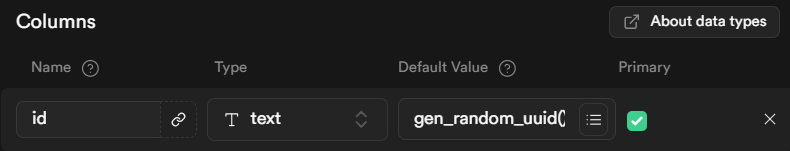

# 📌 8주차 세션 15: OAuth

## How to setup Google OAuth
### 1. console.cloud.google.com 접속
### 2. 왼쪽 메뉴 → APIs & Services → OAuth consent screen → 새 프로젝트 생성
- App Information: 앱 이름, 이메일
- Audience: External
- Contact Information: 이메일
### 3. 왼쪽 메뉴 → Clients
- Application type: Web application
- Name: NextAuth Client
- Authorized redirect URIs:
    - https://[your_base_url]/api/auth/callback/google
    - http://localhost:3000/api/auth/callback/google
- Client ID, Client secret 복사 (Download JSON으로 안전한 곳에 보관 추천)
### 4. .env file
```text
    GOOGLE_CLIENT_ID=your-google-client-id-here
    GOOGLE_CLIENT_SECRET=your-google-client-secret-here
    NEXTAUTH_URL=http://localhost:3000
```

### 5. [...nextauth].ts
- Google Provider 추가
```ts
import GoogleProvider from "next-auth/providers/google";
```
- callbacks.signIn 추가

### 6. 로그인 페이지
- Google 로그인 버튼 추가
- useEffect로 re-routing
- AuthButton에서 로그인 성공 시 sign out 대신 mypage로 가는 버튼으로 만들기

### 7. Supabase profiles table 수정
- gen_random_uuid()

```bash
npx prisma db pull
npx prisma generate
```

### 8. test
- https://myaccount.google.com/permissions

++ 유저의 Google 내 집주소, 전화번호 등을 불러오려면 정식 앱 허가 필요.

## User information editing modal
### 1. server action
- app/actions/updateProfileInfo.ts
- app/actions/getMyProfile.ts
### 2. ProfileEditModal
- components/ProfileEditModal.tsx
### 3. Put modal button
- app/mypage/page.tsx